<style>
/* Estils globals del document */
body {
  font-family: Helvetica, Arial, sans-serif;
  font-size: 9pt;
  text-align: justify;
  line-height: 1.4;
}

/* Paràgrafs justificats */
p {
  text-align: justify;
  font-size: 9pt;
}

/* Estils per a les llistes amb la mateixa mida que el text normal */
ul, ol, code {
  font-size: 9pt;
  line-height: 1.4;
}

li {
  font-size: 9pt;
  line-height: 1.4;
}

/* Títols més petits */
h1 {
  font-size: 13pt;
  text-align: left;
}

h2 {
  font-size: 12pt;
  text-align: left;
  font-weight: bold;
}

h3 {
  font-size: 11pt;
  text-align: left;
  font-weight: bold;
}

h4 {
  font-size: 9pt;
  text-align: left;
}

h5{
  font-size: 9pt;
  text-align: left;
  text-decoration: underline;
}

/* CORRECCIONS PER A BLOCS DE CODI */
pre {
  max-width: 100%;
  overflow-x: auto;
  white-space: pre-wrap;
  word-wrap: break-word;
  overflow-wrap: break-word;
  background-color: #f5f5f5;
  padding: 0.5rem;
  border: 1px solid #ddd;
  border-radius: 3px;
  font-size: 8pt;
  line-height: 1.4;
  min-width: 0;
}

code {
  font-size: 8pt;
  overflow-wrap: break-word;
  word-wrap: break-word;
  word-break: break-word;
  white-space: pre-wrap;
  font-style: monospace;
}

/* Contenidor principal */
.image-row {
  display: flex;
  flex-wrap: wrap;
  justify-content: center;
  gap: 1rem;       /* Espai entre imatges */
  margin-top: 1rem;
  margin-bottom: 1rem;
  align-items: flex-start;
  width: 100%;
}

/* MODIFICAT: Reduïm la base (flex-basis) a 180px perquè hi capiguin 3 en una fila */
.image-column {
  flex: 1 1 180px; /* Abans 280px. Amb 180px, 3 imatges sumen ~540px + marges, que hi cap perfecte */
  max-width: 320px; /* Mida màxima per evitar que es facin gegants si n'hi ha poques */
  display: flex;
  flex-direction: column;
  align-items: center;
  box-sizing: border-box;
}

/* Regla específica: Si només hi ha UNA imatge, la deixem ser més gran */
.image-row:has(.image-column:only-child) .image-column {
  max-width: 480px;
  flex: 0 1 auto;
}

/* Imatges */
.image-column img {
  width: 100%;
  max-height: 280px; /* Limitem l'alçada */
  height: auto;
  display: block;
  object-fit: contain;
}

/* Peu de foto */
.image-column .caption {
  margin-top: 0.5rem;
  font-size: 8pt;
  text-align: center;
  color: #555;
  width: 100%;
}

/* ============================================
    CONTENIDOR GRID 2x2 PER A IMATGES
    ============================================ */
.image-grid {
  display: grid;
  grid-template-columns: repeat(2, 1fr);
  gap: 0.8rem;
  margin-top: 1rem;
  margin-bottom: 1rem;
  width: 100%;
  max-width: 720px;
  margin-left: auto;
  margin-right: auto;
}

/* Cada cel·la del grid */
.image-grid .grid-item {
  display: flex;
  flex-direction: column;
  align-items: center;
  box-sizing: border-box;
}

/* Imatges dins del grid 2x2 */
.image-grid .grid-item img {
  width: 100%;
  max-width: 360px;
  max-height: 320px;
  height: auto;
  display: block;
  object-fit: contain;
}

/* Peu de foto per a cada imatge del grid */
.image-grid .grid-item .caption {
  margin-top: 0.5rem;
  font-size: 8pt;
  text-align: center;
  color: #555;
  width: 100%;
}

/* Peu de figura general (opcional, per sota de tot el grid) */
.image-grid-caption {
  margin-top: 0.8rem;
  font-size: 8pt;
  text-align: center;
  color: #555;
  font-style: italic;
}

/* Estil per a la separació de pàgines en PDF */
.page-break {
  page-break-before: always;
  break-before: page;
}

/* Bloc imatge-esquerra / text-dreta */
.media-row {
  display: flex;
  gap: 1.5rem;
  align-items: flex-start;
  margin: 1rem 0;
  min-width: 0;
}

.media-image {
  flex: 0 0 38%;
  max-width: 240px;
  display: flex;
  flex-direction: column;
  align-items: center;
}

.media-image img {
  width: 100%;
  height: auto;
  display: block;
}

.media-image .caption {
  margin-top: 0.5rem;
  font-size: 8pt;
  text-align: center;
  color: #555;
}

.media-text {
  flex: 1 1 0;
  min-width: 240px;
}

/* ============================================
    CONTENIDOR DE TAULES AMB PEU DE TAULA
    ============================================ */
.table-container {
  width: 100%;
  margin: 1.5rem 0;
  overflow-x: auto;
  page-break-inside: avoid;
}

/* Estils per a les taules */
.table-container table {
  width: 100%;
  max-width: 100%;
  border-collapse: collapse;
  font-size: 7pt;
  margin: 0 auto;
  background-color: #fff;
}

/* Capçalera de taula */
.table-container thead {
  background-color: #e0e0e0;
  font-weight: bold;
}

.table-container th {
  padding: 8px 6px;
  text-align: center;
  border: 1px solid #888;
  font-size: 7pt;
}

/* Files de dades */
.table-container td {
  padding: 6px 5px;
  text-align: center;
  border: 1px solid #aaa;
  font-size: 7pt;
}

.table-container td code {
  font-size: 7pt;
}

/* Files alternades (zebra striping) */
.table-container tbody tr:nth-child(even) {
  background-color: #f5f5f5;
}

/* Peu de taula (caption) */
.table-container .table-caption {
  margin-top: 0.5rem;
  font-size: 8pt;
  text-align: center;
  color: #555;
  font-style: italic;
}

/* Estil alternatiu: caption sobre la taula */
.table-container .table-title {
  margin-bottom: 0.5rem;
  font-size: 9pt;
  text-align: center;
  font-weight: bold;
  color: #333;
}

/* Estil per a les citacions in-document (elevades i petites) */
a[href^="#bib"] {
    vertical-align: super;
    font-size: 7pt;        /* Més petita que el text de 9pt */
    text-decoration: none;
    font-weight: bold;
    margin-left: 1px;
}

/* Opcional: canviar el color perquè sembli una citació clàssica */
a[href^="#bib"]:hover {
    text-decoration: underline;
    color: #0056b3;
}

/* Millores per a impressió/PDF */
@media print {
  .table-container {
    page-break-inside: avoid;
  }

  .table-container table {
    border: 1px solid #000;
  }

  .table-container th,
  .table-container td {
    border: 1px solid #666;
  }

  .image-column {
    page-break-inside: avoid;
  }

  /* Límits més restrictius per a PDF */
  .image-column img {
    max-height: 280px;
  }

  .image-row:has(.image-column:only-child) .image-column img {
    max-height: 360px;
  }

  /* Grid 2x2 en impressió */
  .image-grid {
    page-break-inside: avoid;
  }

  .image-grid .grid-item img {
    max-height: 280px;
  }

  pre {
    page-break-inside: avoid;
    overflow: visible;
    white-space: pre-wrap;
  }
}

@page {
  @bottom-center {
    content: "Pàgina " counter(page) " de " counter(pages);
    font-size: 8pt;
    color: #555;
    font-family: Helvetica, Arial, sans-serif;
  }
}
</style>

## 0. Taula de continguts

- [0. Taula de continguts](#0-taula-de-continguts)
- [1. Introducció](#1-introducció)
- [2. Informació del problema](#2-informació-del-problema)
- [3. Anàlisi exploratori descriptiu](#3-anàlisi-exploratori-descriptiu)
  - [3.1 Anàlisi de les variables](#31-anàlisi-de-les-variables)
  - [3.2 Desbalanceig de la classe objectiu](#32-desbalanceig-de-la-classe-objectiu)
  - [3.3 Valors perduts](#33-valors-perduts)
  - [3.4 *Outliers*](#34-outliers)
  - [3.5 Estudi de dimensionalitat](#35-estudi-de-dimensionalitat)
  - [3.6 Partició del conjunt de dades](#36-partició-del-conjunt-de-dades)
- [4. Ajustament de models](#4-ajustament-de-models)
  - [4.1 SVM](#41-svm)
    - [4.1.1 Preprocessament](#411-preprocessament)
    - [4.1.2 Ajustament del model](#412-ajustament-del-model)
  - [4.2 XGBoost](#42-xgboost)
    - [4.2.1 Preprocessament](#421-preprocessament)
    - [4.2.2 Ajustament del model](#422-ajustament-del-model)
  - [4.3 Regressió logística personalitzada](#43-regressió-logística-personalitzada)
    - [4.3.1 Preprocessament](#431-preprocessament)
    - [4.3.2 Ajustament del model](#432-ajustament-del-model)
    - [4.3.3 Resultat final](#433-resultat-final)
- [5. Model final](#5-model-final)
- [6. Model Card](#6-model-card)
- [7. Conclusions](#7-conclusions)
- [8. Referències](#8-referències)

<div class="page-break"></div>

## 1. Introducció

## 2. Informació del problema

## 3. Anàlisi exploratori descriptiu

En aquesta secció es presenta l'anàlisi exploratori descriptiu (AED) realitzat sobre el conjunt de dades proporcionat per al problema de predicció clínica. L'objectiu principal d'aquesta anàlisi és comprendre millor les característiques de les dades, identificar possibles problemes com valors perduts o *outliers*, i preparar les dades per a l'ajustament dels models predictius.

### 3.1 Anàlisi de les variables

Observem primer de tot la taula de dades per tenir una visió general de les variables disponibles i la seva tipologia. L'obtenim amb la comanda `df.describe().T`, que ens proporciona estadístiques descriptives per a les variables numèriques i categòriques. El resultat ha estat:

<div class="table-container">
  <table style="border-collapse: collapse; width: 100%;">
    <thead>
      <tr>
        <th style="text-align:left; padding: 3px 5px; border-bottom: 2px solid #ddd;">Variable</th>
        <th style="padding: 3px 5px; border-bottom: 2px solid #ddd;">N</th>
        <th style="padding: 3px 5px; border-bottom: 2px solid #ddd;">Mean (SD)</th>
        <th style="padding: 3px 5px; border-bottom: 2px solid #ddd;">Min</th>
        <th style="padding: 3px 5px; border-bottom: 2px solid #ddd;">25%</th>
        <th style="padding: 3px 5px; border-bottom: 2px solid #ddd;">Median</th>
        <th style="padding: 3px 5px; border-bottom: 2px solid #ddd;">75%</th>
        <th style="padding: 3px 5px; border-bottom: 2px solid #ddd;">Max</th>
        <th style="padding: 3px 5px; border-bottom: 2px solid #ddd;">Missing (%)</th>
      </tr>
    </thead>
    <tbody>
      <tr>
        <td style="text-align:left; padding: 2px 5px;">Age</td>
        <td style="padding: 2px 5px;">9000</td>
        <td style="padding: 2px 5px;">26.04 (10.01)</td>
        <td style="padding: 2px 5px;">13.00</td>
        <td style="padding: 2px 5px;">19.00</td>
        <td style="padding: 2px 5px;">25.00</td>
        <td style="padding: 2px 5px;">31.00</td>
        <td style="padding: 2px 5px;">64.00</td>
        <td style="padding: 2px 5px;">0.00%</td>
      </tr>
      <tr>
        <td style="text-align:left; padding: 2px 5px;">Sex (0=F, 1=M)</td>
        <td style="padding: 2px 5px;">9000</td>
        <td style="padding: 2px 5px;">0.58 (0.49)</td>
        <td style="padding: 2px 5px;">0.00</td>
        <td style="padding: 2px 5px;">0.00</td>
        <td style="padding: 2px 5px;">1.00</td>
        <td style="padding: 2px 5px;">1.00</td>
        <td style="padding: 2px 5px;">1.00</td>
        <td style="padding: 2px 5px;">0.00%</td>
      </tr>
      <tr>
        <td style="text-align:left; padding: 2px 5px;">BMI</td>
        <td style="padding: 2px 5px;">9000</td>
        <td style="padding: 2px 5px;">28.11 (5.43)</td>
        <td style="padding: 2px 5px;">15.00</td>
        <td style="padding: 2px 5px;">24.40</td>
        <td style="padding: 2px 5px;">28.00</td>
        <td style="padding: 2px 5px;">31.70</td>
        <td style="padding: 2px 5px;">49.60</td>
        <td style="padding: 2px 5px;">0.00%</td>
      </tr>
      <tr>
        <td style="text-align:left; padding: 2px 5px;">Duration Untreated Psychosis</td>
        <td style="padding: 2px 5px;">8872</td>
        <td style="padding: 2px 5px;">19.22 (19.55)</td>
        <td style="padding: 2px 5px;">0.30</td>
        <td style="padding: 2px 5px;">6.40</td>
        <td style="padding: 2px 5px;">12.50</td>
        <td style="padding: 2px 5px;">24.30</td>
        <td style="padding: 2px 5px;">125.00</td>
        <td style="padding: 2px 5px;">1.42%</td>
      </tr>
      <tr>
        <td style="text-align:left; padding: 2px 5px;">Family History</td>
        <td style="padding: 2px 5px;">9000</td>
        <td style="padding: 2px 5px;">0.12 (0.32)</td>
        <td style="padding: 2px 5px;">0.00</td>
        <td style="padding: 2px 5px;">0.00</td>
        <td style="padding: 2px 5px;">0.00</td>
        <td style="padding: 2px 5px;">0.00</td>
        <td style="padding: 2px 5px;">1.00</td>
        <td style="padding: 2px 5px;">0.00%</td>
      </tr>
      <tr>
        <td style="text-align:left; padding: 2px 5px;">Initial Response</td>
        <td style="padding: 2px 5px;">9000</td>
        <td style="padding: 2px 5px;">41.84 (30.16)</td>
        <td style="padding: 2px 5px;">0.00</td>
        <td style="padding: 2px 5px;">10.10</td>
        <td style="padding: 2px 5px;">38.20</td>
        <td style="padding: 2px 5px;">72.30</td>
        <td style="padding: 2px 5px;">100.00</td>
        <td style="padding: 2px 5px;">0.00%</td>
      </tr>
      <tr>
        <td style="text-align:left; padding: 2px 5px;">Prior Antipsychotics</td>
        <td style="padding: 2px 5px;">9000</td>
        <td style="padding: 2px 5px;">0.41 (0.67)</td>
        <td style="padding: 2px 5px;">0.00</td>
        <td style="padding: 2px 5px;">0.00</td>
        <td style="padding: 2px 5px;">0.00</td>
        <td style="padding: 2px 5px;">1.00</td>
        <td style="padding: 2px 5px;">2.00</td>
        <td style="padding: 2px 5px;">0.00%</td>
      </tr>
      <tr>
        <td style="text-align:left; padding: 2px 5px;">TRS (Target)</td>
        <td style="padding: 2px 5px;">9000</td>
        <td style="padding: 2px 5px;">0.32 (0.46)</td>
        <td style="padding: 2px 5px;">0.00</td>
        <td style="padding: 2px 5px;">0.00</td>
        <td style="padding: 2px 5px;">0.00</td>
        <td style="padding: 2px 5px;">1.00</td>
        <td style="padding: 2px 5px;">1.00</td>
        <td style="padding: 2px 5px;">0.00%</td>
      </tr>
      <tr>
        <td style="text-align:left; padding: 2px 5px;">Lymphocyte count</td>
        <td style="padding: 2px 5px;">7009</td>
        <td style="padding: 2px 5px;">1.80 (0.60)</td>
        <td style="padding: 2px 5px;">0.50</td>
        <td style="padding: 2px 5px;">1.38</td>
        <td style="padding: 2px 5px;">1.80</td>
        <td style="padding: 2px 5px;">2.20</td>
        <td style="padding: 2px 5px;">4.02</td>
        <td style="padding: 2px 5px;">22.12%</td>
      </tr>
      <tr>
        <td style="text-align:left; padding: 2px 5px;">Neutrophil count</td>
        <td style="padding: 2px 5px;">7015</td>
        <td style="padding: 2px 5px;">5.01 (1.47)</td>
        <td style="padding: 2px 5px;">1.50</td>
        <td style="padding: 2px 5px;">4.01</td>
        <td style="padding: 2px 5px;">5.02</td>
        <td style="padding: 2px 5px;">6.01</td>
        <td style="padding: 2px 5px;">9.96</td>
        <td style="padding: 2px 5px;">22.06%</td>
      </tr>
      <tr>
        <td style="text-align:left; padding: 2px 5px;">Triglycerides</td>
        <td style="padding: 2px 5px;">6547</td>
        <td style="padding: 2px 5px;">152.01 (61.10)</td>
        <td style="padding: 2px 5px;">40.00</td>
        <td style="padding: 2px 5px;">108.05</td>
        <td style="padding: 2px 5px;">151.10</td>
        <td style="padding: 2px 5px;">194.60</td>
        <td style="padding: 2px 5px;">394.60</td>
        <td style="padding: 2px 5px;">27.26%</td>
      </tr>
      <tr>
        <td style="text-align:left; padding: 2px 5px;">Glucose</td>
        <td style="padding: 2px 5px;">6381</td>
        <td style="padding: 2px 5px;">95.86 (18.31)</td>
        <td style="padding: 2px 5px;">65.00</td>
        <td style="padding: 2px 5px;">82.20</td>
        <td style="padding: 2px 5px;">95.50</td>
        <td style="padding: 2px 5px;">108.30</td>
        <td style="padding: 2px 5px;">159.60</td>
        <td style="padding: 2px 5px;">29.10%</td>
      </tr>
      <tr>
        <td style="text-align:left; padding: 2px 5px;">Alkaline Phosphatase</td>
        <td style="padding: 2px 5px;">6062</td>
        <td style="padding: 2px 5px;">85.17 (24.83)</td>
        <td style="padding: 2px 5px;">30.00</td>
        <td style="padding: 2px 5px;">68.20</td>
        <td style="padding: 2px 5px;">84.70</td>
        <td style="padding: 2px 5px;">101.90</td>
        <td style="padding: 2px 5px;">179.30</td>
        <td style="padding: 2px 5px;">32.64%</td>
      </tr>
      <tr>
        <td style="text-align:left; padding: 2px 5px;">IL-17A</td>
        <td style="padding: 2px 5px;">8999</td>
        <td style="padding: 2px 5px;">2.66 (0.80)</td>
        <td style="padding: 2px 5px;">-0.20</td>
        <td style="padding: 2px 5px;">2.12</td>
        <td style="padding: 2px 5px;">2.65</td>
        <td style="padding: 2px 5px;">3.21</td>
        <td style="padding: 2px 5px;">5.38</td>
        <td style="padding: 2px 5px;">0.01%</td>
      </tr>
      <tr>
        <td style="text-align:left; padding: 2px 5px;">CCL23</td>
        <td style="padding: 2px 5px;">9000</td>
        <td style="padding: 2px 5px;">3.78 (1.05)</td>
        <td style="padding: 2px 5px;">-0.20</td>
        <td style="padding: 2px 5px;">3.08</td>
        <td style="padding: 2px 5px;">3.78</td>
        <td style="padding: 2px 5px;">4.49</td>
        <td style="padding: 2px 5px;">7.69</td>
        <td style="padding: 2px 5px;">0.00%</td>
      </tr>
      <tr>
        <td style="text-align:left; padding: 2px 5px;">TWEAK</td>
        <td style="padding: 2px 5px;">9000</td>
        <td style="padding: 2px 5px;">4.19 (1.24)</td>
        <td style="padding: 2px 5px;">-0.54</td>
        <td style="padding: 2px 5px;">3.37</td>
        <td style="padding: 2px 5px;">4.19</td>
        <td style="padding: 2px 5px;">5.04</td>
        <td style="padding: 2px 5px;">8.92</td>
        <td style="padding: 2px 5px;">0.00%</td>
      </tr>
      <tr>
        <td style="text-align:left; padding: 2px 5px;">HLA-DRB1*04:02</td>
        <td style="padding: 2px 5px;">9000</td>
        <td style="padding: 2px 5px;">0.02 (0.15)</td>
        <td style="padding: 2px 5px;">0.00</td>
        <td style="padding: 2px 5px;">0.00</td>
        <td style="padding: 2px 5px;">0.00</td>
        <td style="padding: 2px 5px;">0.00</td>
        <td style="padding: 2px 5px;">1.00</td>
        <td style="padding: 2px 5px;">0.00%</td>
      </tr>
      <tr>
        <td style="text-align:left; padding: 2px 5px;">HLA-B*15:02</td>
        <td style="padding: 2px 5px;">9000</td>
        <td style="padding: 2px 5px;">0.03 (0.18)</td>
        <td style="padding: 2px 5px;">0.00</td>
        <td style="padding: 2px 5px;">0.00</td>
        <td style="padding: 2px 5px;">0.00</td>
        <td style="padding: 2px 5px;">0.00</td>
        <td style="padding: 2px 5px;">1.00</td>
        <td style="padding: 2px 5px;">0.00%</td>
      </tr>
      <tr>
        <td style="text-align:left; padding: 2px 5px;">HLA-A*31:01</td>
        <td style="padding: 2px 5px;">9000</td>
        <td style="padding: 2px 5px;">0.05 (0.21)</td>
        <td style="padding: 2px 5px;">0.00</td>
        <td style="padding: 2px 5px;">0.00</td>
        <td style="padding: 2px 5px;">0.00</td>
        <td style="padding: 2px 5px;">0.00</td>
        <td style="padding: 2px 5px;">1.00</td>
        <td style="padding: 2px 5px;">0.00%</td>
      </tr>
      <tr>
        <td style="text-align:left; padding: 2px 5px;">Polygenic Risk Score</td>
        <td style="padding: 2px 5px;">8999</td>
        <td style="padding: 2px 5px;">0.030 (0.14)</td>
        <td style="padding: 2px 5px;">-0.44</td>
        <td style="padding: 2px 5px;">-0.07</td>
        <td style="padding: 2px 5px;">0.02</td>
        <td style="padding: 2px 5px;">0.11</td>
        <td style="padding: 2px 5px;">0.58</td>
        <td style="padding: 2px 5px;">0.01%</td>
      </tr>
      <tr>
        <td style="text-align:left; padding: 2px 5px;">Del 22q11.2</td>
        <td style="padding: 2px 5px;">9000</td>
        <td style="padding: 2px 5px;">0.009 (0.09)</td>
        <td style="padding: 2px 5px;">0.00</td>
        <td style="padding: 2px 5px;">0.00</td>
        <td style="padding: 2px 5px;">0.00</td>
        <td style="padding: 2px 5px;">0.00</td>
        <td style="padding: 2px 5px;">1.00</td>
        <td style="padding: 2px 5px;">0.00%</td>
      </tr>
      <tr>
        <td style="text-align:left; padding: 2px 5px;">Ki Whole Striatum</td>
        <td style="padding: 2px 5px;">9000</td>
        <td style="padding: 2px 5px;">0.0130 (0.002)</td>
        <td style="padding: 2px 5px;">0.0080</td>
        <td style="padding: 2px 5px;">0.0113</td>
        <td style="padding: 2px 5px;">0.0129</td>
        <td style="padding: 2px 5px;">0.0145</td>
        <td style="padding: 2px 5px;">0.0200</td>
        <td style="padding: 2px 5px;">0.00%</td>
      </tr>
      <tr>
        <td style="text-align:left; padding: 2px 5px;">Ki Associative Striatum</td>
        <td style="padding: 2px 5px;">9000</td>
        <td style="padding: 2px 5px;">0.0130 (0.002)</td>
        <td style="padding: 2px 5px;">0.0071</td>
        <td style="padding: 2px 5px;">0.0113</td>
        <td style="padding: 2px 5px;">0.0128</td>
        <td style="padding: 2px 5px;">0.0146</td>
        <td style="padding: 2px 5px;">0.0210</td>
        <td style="padding: 2px 5px;">0.00%</td>
      </tr>
      <tr>
        <td style="text-align:left; padding: 2px 5px;">SUVRc Whole Striatum</td>
        <td style="padding: 2px 5px;">9000</td>
        <td style="padding: 2px 5px;">1.18 (0.27)</td>
        <td style="padding: 2px 5px;">0.80</td>
        <td style="padding: 2px 5px;">0.97</td>
        <td style="padding: 2px 5px;">1.16</td>
        <td style="padding: 2px 5px;">1.36</td>
        <td style="padding: 2px 5px;">2.00</td>
        <td style="padding: 2px 5px;">0.00%</td>
      </tr>
      <tr>
        <td style="text-align:left; padding: 2px 5px;">SUVRc Assoc. Striatum</td>
        <td style="padding: 2px 5px;">9000</td>
        <td style="padding: 2px 5px;">1.18 (0.27)</td>
        <td style="padding: 2px 5px;">0.80</td>
        <td style="padding: 2px 5px;">0.96</td>
        <td style="padding: 2px 5px;">1.16</td>
        <td style="padding: 2px 5px;">1.37</td>
        <td style="padding: 2px 5px;">2.00</td>
        <td style="padding: 2px 5px;">0.00%</td>
      </tr>
    </tbody>
  </table>
  <div class="table-caption">Taula 1: Resum estadístic de totes les variables numèriques i categòriques del conjunt d'entrenament. Es mostra el recompte (N), mitjana i desviació estàndard, quartils i percentatge de valors perduts.</div>
</div>

Obeservem que el conjunt de dades conté un total de 9000 mostres i diverses variables predictives, així com la variable objectiu `TRS (Target)`. Algunes variables presenten valors perduts, especialment les mèdiques com el recompte de limfòcits i neutròfils, triglicèrids, glucosa i fosfatasa alcalina, que gestionarem més endavant a la [secció 3.3](#33-valors-perduts).

Pel que fa les distribucions de les variables, la majoria semblen tenir una distribució aproximadament normal, o de combinacions de normals, com per exemple:

<div class="image-grid">
  <div class="grid-item">
    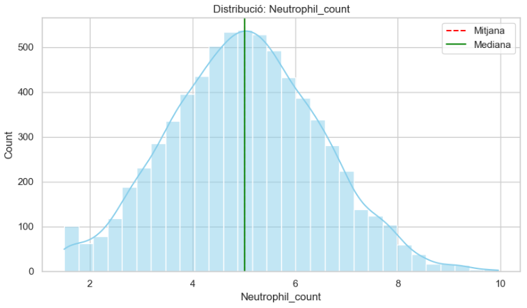
    <div class="caption">Figura 1: Distribució de <code>Neutrophil count</code>.</div>
  </div>
  <div class="grid-item">
    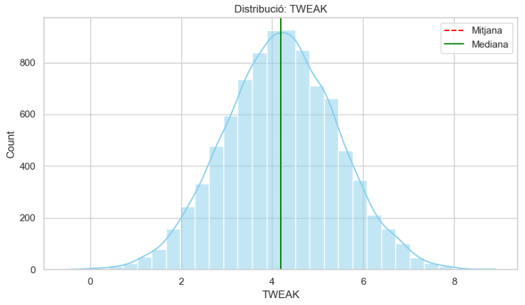
    <div class="caption">Figura 2: Distribució de <code>TWEAK</code>.</div>
  </div>
  <div class="grid-item">
    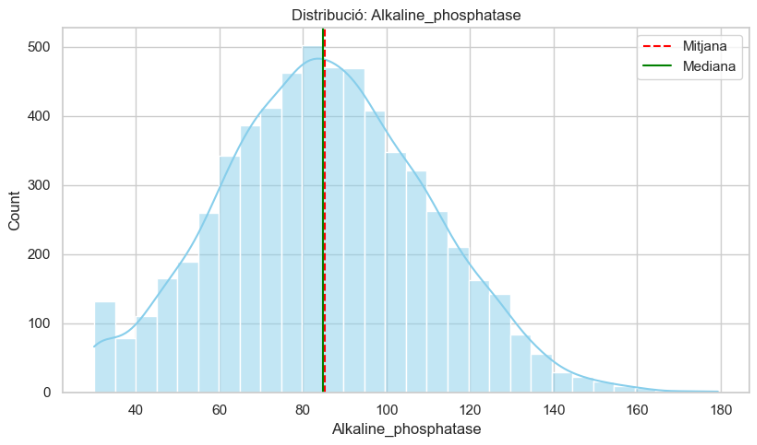
    <div class="caption">Figura 3: Distribució de <code>Alkaline phosphatase</code></div>
  </div>
  <div class="grid-item">
    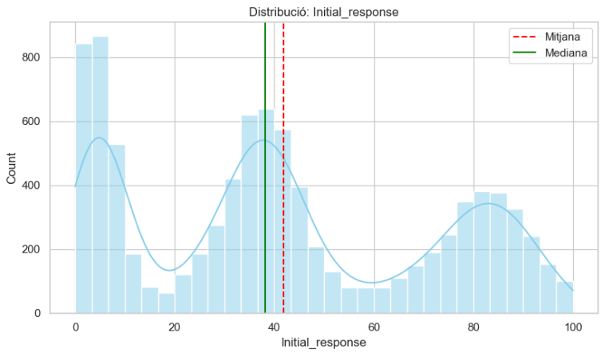
    <div class="caption">Figura 4: Distribució de <code>Initial response</code>.</div>
  </div>
</div>

Aquestes variables es poden utilitzar directament en els models predictius, ja que no requereixen transformacions addicionals per a la seva normalització. No obstant això, algunes variables com el `Duration_Untreated_Psychosis` o `Age` mostren una distribució més asimètrica:

<div class="image-row">
  <div class="image-column">
    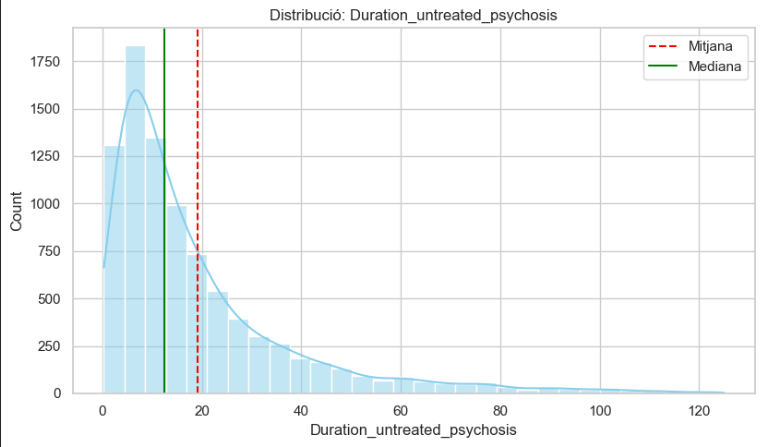
    <div class="caption">Figura 5: Distribució de <code>Duration_Untreated_Psychosis</code>.</div>
  </div>
  <div class="image-column">
    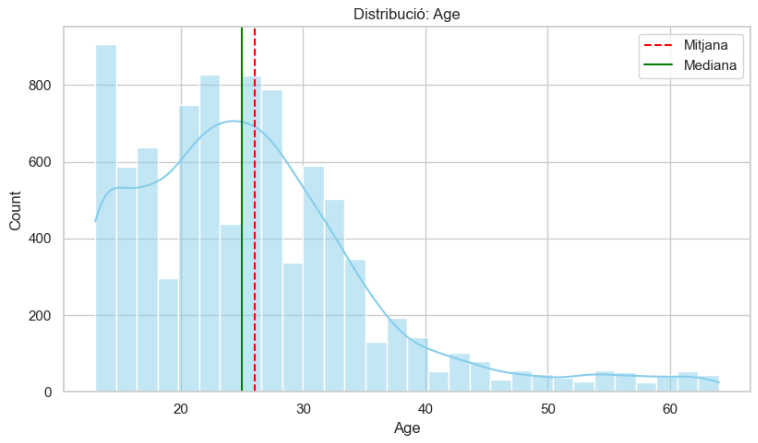
    <div class="caption">Figura 6: Distribució de <code>Age</code>.</div>
  </div>
</div>

En aquest cas podem veure unes cues llargues cap a la dreta, indicant la presència d'alguns valors extrems. Comprovem ràpidament amb el skewness que aquestes variables no són normals. Si tenen un skewness major a 1 o menor a -1, es consideren altament asimètriques. Comprovem:

```bash
ANÀLISI D'ASIMETRIA (SKEWNESS):
--------------------------------------------------------------------------------
                    Variable  Skewness  Kurtosis                                    Estat
Duration_untreated_psychosis  2.150479  5.323006 🔴 MOLT ASIMÈTRICA (Requereix Log/BoxCox)
                         Age  1.258793  2.065980 🔴 MOLT ASIMÈTRICA (Requereix Log/BoxCox)
  SUVRc_associative_striatum  0.457536 -0.422680                     🟢 NORMAL (Simètrica)
        SUVRc_whole_striatum  0.434121 -0.408815                     🟢 NORMAL (Simètrica)
        Polygenic_risk_score  0.405186  0.323084                     🟢 NORMAL (Simètrica)
     Ki_associative_striatum  0.328552 -0.022675                     🟢 NORMAL (Simètrica)
...
```

Aquest desequilibri en la distribució de les dades pot afectar el rendiment dels models predictius, especialment aquells que assumeixen normalitat en les variables. Per tant, considerarem aplicar transformacions com el logaritme o Box-Cox a aquestes variables abans de l'ajustament dels models.

Mirem la correlació entre les variables numèriques per identificar possibles relacions lineals que puguin ser útils per a la predicció. Utilitzem un mapa de calor per visualitzar aquestes correlacions:

<div class="image-row">
  <div class="image-column">
    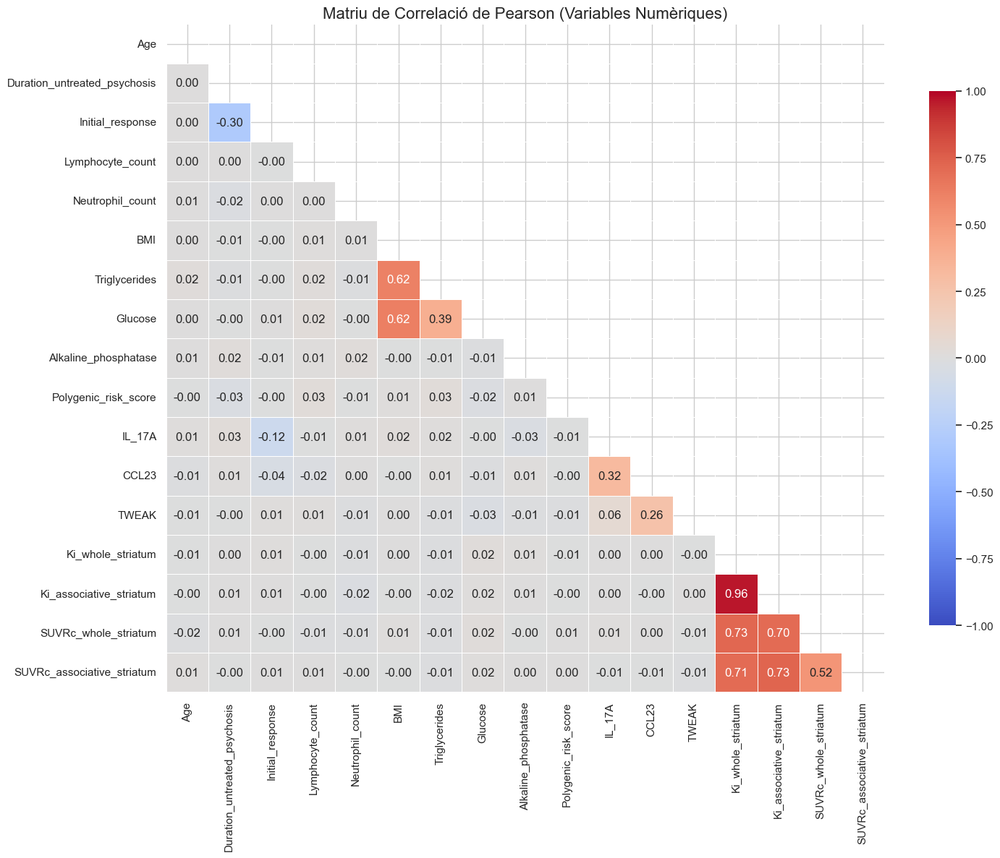
    <div class="caption">Figura 7. Matriu de Correlació de Pearson</div>
  </div>
</div>

Veiem que en termes generals, les correlacions entre les variables molt baixes o pràcticament 0, amb algunes excepcions:

Aquesta imatge mostra una **matriu de correlació de Pearson** (heatmap), que mesura la relació lineal entre diferents variables numèriques del teu dataset. Els valors van de **-1** (blau fosc, correlació negativa perfecta) a **+1** (vermell fosc, correlació positiva perfecta), passant per **0** (gris/blanc, sense correlació).

Aquí tens la interpretació detallada dels patrons més rellevants:

1. Redundància a les Variables avall dreta (Vermell Fosc)
   Aquest és el grup més destacat de la gràfica. Les variables relacionades amb l'estriat (*striatum*) mostren correlacions extremadament altes.
   - **``Ki_whole_striatum``** vs. **``Ki_associative_striatum``:** 0.96
   - **``Ki``** vs. **``SUVRc``**: ~0.70 - 0.73

2. Clúster Metabòlic (Vermell Mig):

   - **``Triglycerides``** vs. **``Glucose``**: 0.62
   - **``Glucose``** vs. **``BMI``**: 0.39

3. Relació entre no tratament i resposta inicial (Blau Fosc):
   - **``Duration_untreated_psychosis``** vs. **``Initial_response``**: -0.30

Aquestes correlacions suggereixen que certes variables estan fortament relacionades i podrien ser redundants en els models predictius. Gestionarem aquestes relacions en la fase de selecció de característiques per optimitzar el rendiment dels models.

### 3.2 Desbalanceig de la classe objectiu

La variable objectiu és `TRS`, que indica si un pacient desenvolupa resistència als tractaments antipsicòtics. La proporció de pacients la mirem executant `ratio_trs = df['TRS'].value_counts(normalize=True)`. El resultat és que el percentatge d'individus a la dataset que desenvolupa TRS és aproximadament del 31.5%, mentre que el 68.4% restant no desenvolupa resistència. Això indica un desbalanceig en les classes, que haurem de gestionar a l'hora de modelar. Aquest desbalanceig es denota en les variables categòriques:

<div class="image-row">
  <div class="image-column">
    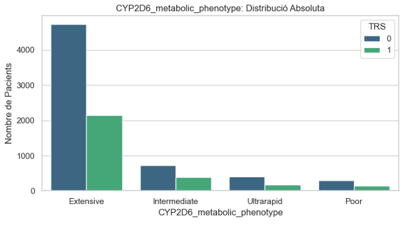
    <div class="caption">Figura 8: Distribució de la variable objectiu <code>TRS</code> </div>
  </div>
  <div class="image-column">
    
    <div class="caption">Figura 9: Distribució de la variable objectiu <code>TRS</code> </div>
  </div>
</div>

Veiem no hi ha cap biaix que provoqui el desbalanceig, ja que la distribució de les altres variables categòriques és força equilibrada. Per tant, per gestionar aquest desbalanceig en la fase d'ajustament dels models, considerarem tècniques com assignar pesos a les classes.

### 3.3 Valors perduts

Com podem veure a la Taula 1, algunes variables tenen un percentatge significatiu de valors perduts. Veiem-ho en més detall:

<div class="table-container">
  <table style="border-collapse: collapse; width: 100%;">
    <thead>
      <tr>
        <th style="text-align:left; padding: 3px 5px; border-bottom: 2px solid #ddd;">Variable</th>
        <th style="padding: 3px 5px; border-bottom: 2px solid #ddd;">Total Missings</th>
        <th style="padding: 3px 5px; border-bottom: 2px solid #ddd;">Percentatge (%)</th>
      </tr>
    </thead>
    <tbody>
      <tr>
        <td style="text-align:left; padding: 2px 5px;">Alkaline_phosphatase</td>
        <td style="padding: 2px 5px; background-color: #67000d; color: white;">2938</td>
        <td style="padding: 2px 5px; background-color: #67000d; color: white;">32.64%</td>
      </tr>
      <tr>
        <td style="text-align:left; padding: 2px 5px;">Glucose</td>
        <td style="padding: 2px 5px; background-color: #a50f15; color: white;">2619</td>
        <td style="padding: 2px 5px; background-color: #a50f15; color: white;">29.10%</td>
      </tr>
      <tr>
        <td style="text-align:left; padding: 2px 5px;">Triglycerides</td>
        <td style="padding: 2px 5px; background-color: #cb181d; color: white;">2453</td>
        <td style="padding: 2px 5px; background-color: #cb181d; color: white;">27.26%</td>
      </tr>
      <tr>
        <td style="text-align:left; padding: 2px 5px; ">Lymphocyte_count</td>
        <td style="padding: 2px 5px; background-color: #ef3b2c; color: white;">1991</td>
        <td style="padding: 2px 5px; background-color: #ef3b2c; color: white;">22.12%</td>
      </tr>
      <tr>
        <td style="text-align:left; padding: 2px 5px;">Neutrophil_count</td>
        <td style="padding: 2px 5px; background-color: #fb6a4a; color: white;">1985</td>
        <td style="padding: 2px 5px; background-color: #fb6a4a; color: white;">22.06%</td>
      </tr>
      <tr>
        <td style="text-align:left; padding: 2px 5px;">Duration_untreated_psychosis</td>
        <td style="padding: 2px 5px; background-color: #fff5f0; color: black;">128</td>
        <td style="padding: 2px 5px; background-color: #fff5f0; color: black;">1.42%</td>
      </tr>
      <tr>
        <td style="text-align:left; padding: 2px 5px;">Polygenic_risk_score</td>
        <td style="padding: 2px 5px; background-color: #ffffff; color: black;">1</td>
        <td style="padding: 2px 5px; background-color: #ffffff; color: black;">0.01%</td>
      </tr>
      <tr>
        <td style="text-align:left; padding: 2px 5px;">IL_17A</td>
        <td style="padding: 2px 5px; background-color: #ffffff; color: black;">1</td>
        <td style="padding: 2px 5px; background-color: #ffffff; color: black;">0.01%</td>
      </tr>
    </tbody>
  </table>
  <div class="table-caption">Taula 2: Valors perduts per variable.</div>
</div>

Experimentalment he provat d'imputar els valors perduts amb diferents tècniques, com la mitjana, mediana, KNN i regressió. Després d'avaluar el rendiment dels models amb aquestes diferents imputacions, he observat que la imputació mitjançant KNN amb k=5 ofereix els millors resultats en termes de precisió i robustesa del model. Per tant, he decidit utilitzar aquesta tècnica per gestionar els valors perduts en les variables mèdiques.

### 3.4 *Outliers*

He fet servir el mètode del IQR per detectar valors extrems en les variables numèriques. Aquest mètode defineix els *outliers* com aquells valors que es troben fora de l'interval $[Q1 - 1.5 \times IQR, Q3 + 1.5 \times IQR]$, on $Q1$ i $Q3$ són el primer i tercer quartil, respectivament, i $IQR$ és el rang interquartílic ($Q3 - Q1$). La taula resultant mostra el nombre d'*outliers* detectats per variable:

<div class="table-container">
  <table>
    <thead>
      <tr>
        <th style="text-align:left; padding:3px 3px;">Variable</th>
        <th style="padding:3px 3px;">n outliers</th>
        <th style="padding:3px 3px;">Outliers (%)</th>
      </tr>
    </thead>
    <tbody>
      <tr>
        <td style="text-align:left; padding:2px 3px;"><b><code>Duration_untreated_psychosis</code></b></td>
        <td style="padding:2px 3px;">651</td>
        <td style="padding:2px 3px;">7.23</td>
      </tr>
      <tr>
        <td style="text-align:left; padding:2px 3px;"><b><code>Age</code></b></td>
        <td style="padding:2px 3px;">360</td>
        <td style="padding:2px 3px;">4.00</td>
      </tr>
      <tr>
        <td style="text-align:left; padding:2px 3px;"><b><code>Polygenic_risk_score</code></b></td>
        <td style="padding:2px 3px;">125</td>
        <td style="padding:2px 3px;">1.39</td>
      </tr>
      <tr>
        <td style="text-align:left; padding:2px 3px;"><b><code>Ki_associative_striatum</code></b></td>
        <td style="padding:2px 3px;">83</td>
        <td style="padding:2px 3px;">0.92</td>
      </tr>
      <tr>
        <td style="text-align:left; padding:2px 3px;"><b><code>Ki_whole_striatum</code></b></td>
        <td style="padding:2px 3px;">71</td>
        <td style="padding:2px 3px;">0.79</td>
      </tr>
      <tr>
        <td style="text-align:left; padding:2px 3px;"><b><code>CCL23</code></b></td>
        <td style="padding:2px 3px;">59</td>
        <td style="padding:2px 3px;">0.66</td>
      </tr>
      <tr>
        <td style="text-align:left; padding:2px 3px;"><b><code>TWEAK</code></b></td>
        <td style="padding:2px 3px;">58</td>
        <td style="padding:2px 3px;">0.64</td>
      </tr>
      <tr>
        <td style="text-align:left; padding:2px 3px;"><b><code>IL_17A</code></b></td>
        <td style="padding:2px 3px;">57</td>
        <td style="padding:2px 3px;">0.63</td>
      </tr>
      <tr>
        <td style="text-align:left; padding:2px 3px;"><b><code>BMI</code></b></td>
        <td style="padding:2px 3px;">39</td>
        <td style="padding:2px 3px;">0.43</td>
      </tr>
      <tr>
        <td style="text-align:left; padding:2px 3px;"><b><code>SUVRc_whole_striatum</code></b></td>
        <td style="padding:2px 3px;">35</td>
        <td style="padding:2px 3px;">0.39</td>
      </tr>
      <tr>
        <td style="text-align:left; padding:2px 3px;"><b><code>Neutrophil_count</code></b></td>
        <td style="padding:2px 3px;">32</td>
        <td style="padding:2px 3px;">0.36</td>
      </tr>
      <tr>
        <td style="text-align:left; padding:2px 3px;"><b><code>SUVRc_associative_striatum</code></b></td>
        <td style="padding:2px 3px;">29</td>
        <td style="padding:2px 3px;">0.32</td>
      </tr>
      <tr>
        <td style="text-align:left; padding:2px 3px;"><b><code>Lymphocyte_count</code></b></td>
        <td style="padding:2px 3px;">26</td>
        <td style="padding:2px 3px;">0.29</td>
      </tr>
      <tr>
        <td style="text-align:left; padding:2px 3px;"><b><code>Alkaline_phosphatase</code></b></td>
        <td style="padding:2px 3px;">23</td>
        <td style="padding:2px 3px;">0.26</td>
      </tr>
      <tr>
        <td style="text-align:left; padding:2px 3px;"><b><code>Triglycerides</code></b></td>
        <td style="padding:2px 3px;">22</td>
        <td style="padding:2px 3px;">0.24</td>
      </tr>
      <tr>
        <td style="text-align:left; padding:2px 3px;"><b><code>Glucose</code></b></td>
        <td style="padding:2px 3px;">16</td>
        <td style="padding:2px 3px;">0.18</td>
      </tr>
    </tbody>
  </table>
  <div class="table-caption">Taula 3: Variables amb valors extrems (outliers).</div>
</div>

Com veiem, la variable amb més outliers és `Duration_untreated_psychosis`, amb un total de 651 valors extrems, representant el 7.23% del total de mostres. Aquesta variable mostra una distribució molt asimètrica, amb una cua llarga cap a la dreta, indicant que hi ha alguns pacients amb períodes molt llargs sense tractament. Aquesta variable podria beneficiar-se d'una transformació logarítmica per reduir l'impacte dels outliers en els models predictius. El mateix passa amb la variable `Age`, que també presenta una quantitat significativa d'outliers (360 valors, 4.00%). La resta de variables tenen un nombre relativament baix d'outliers, tots per sota de l'1% del total de mostres.

Per tant, he decidit no eliminar aquests outliers, ja que podrien contenir informació rellevant sobre pacients amb característiques extremes. En lloc d'això, aplicaré transformacions adequades a aquestes variables per minimitzar el seu impacte en els models predictius. Pel que fa a les altres variables amb pocs outliers, no aplicaré cap acció específica, ja que la seva presència és mínima i no afectarà significativament els resultats dels models. A més, en un context mèdic, eliminar valors extrems podria conduir a la pèrdua d'informació important sobre pacients amb condicions rares o greus, que poden ser crucials per a la predicció.

### 3.5 Estudi de dimensionalitat

He realitzat una anàlisi de components principals (PCA) per avaluar la dimensionalitat del conjunt de dades i identificar possibles reduccions de dimensions que puguin millorar l'eficiència dels models predictius. La PCA és una tècnica estadística que transforma les variables originals en un nou conjunt de variables no correlacionades, anomenades components principals, que capturen la major part de la variància present en les dades. Com que no tolera valors perduts, he utilitzat el conjunt de dades amb els valors imputats mitjançant KNN.
També eliminem la variable objectiu `TRS` abans d'aplicar la PCA, ja que aquesta tècnica només s'aplica a les variables predictives i la variable `id_patient`, que és un identificador únic per a cada pacient i no aporta informació rellevant per a la predicció. L'apliquem fent ús de la lliberieria `sklearn.decomposition.PCA`, i els resultats obtinguts són els següents:

<div class="image-row">
  <div class="image-column">
    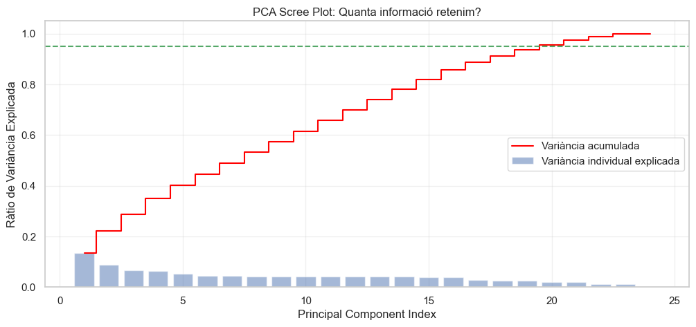
    <div class="caption">Figura 10: Gràfica de Scree Plot de la PCA</div>
  </div>
</div>

Podem veure que calen 20 components per explicar el 95% de la variància total del conjunt de dades. Això indica que hi ha una certa redundància entre les variables originals, ja que només es necessiten 20 components per capturar la major part de la informació. No obstant això, com que el nombre original de variables no és molt alt, he decidit no reduir la dimensionalitat en aquesta fase i mantenir totes les variables originals per a l'ajustament dels models. Això permetrà als models aprofitar tota la informació disponible i potencialment millorar el rendiment predictiu.

### 3.6 Partició del conjunt de dades

En models de machines learning, és fonamental dividir el conjunt de dades en subconjunts d'entrenament i prova per avaluar el rendiment dels models de manera objectiva. He utilitzat una divisió del 80% per a l'entrenament i del 20% per a la prova, assegurant-me que ambdues particions mantinguin la mateixa proporció de la variable objectiu `TRS` (estratificació). Això es fa per garantir que els models es trenin i s'avaluïn en mostres representatives de totes les classes. He utilitzat la funció `train_test_split` de la biblioteca `sklearn.model_selection`, amb el paràmetre `stratify` per assegurar aquesta estratificació.

Aquesta divisió es farà de manera individual en cada model, per assegurar que qualsevol preprocessament específic del model no afecti la partició dels dades.

## 4. Ajustament de models

Els 3 models bàsics a ajustar són Support Vector Machine (SVM), XGBoost i una regressió logística personalitzada. A continuació es detallen els passos seguits per a cada model, incloent el preprocessament, l'ajustament del model i els resultats finals obtinguts.

### 4.1 SVM

Support Vector Machine (SVM) és un model de classificació potent que busca trobar l'hiperplà que millor separa les classes en l'espai de característiques. Aquest SVM serà ajustat amb la biblioteca `sklearn.svm.SVC`, provant diferents nuclis i ajustant els hiperparàmetres mitjançant una cerca en quadrícula (`GridSearchCV`).

#### 4.1.1 Preprocessament

El processament de les dades per al model SVM inclou els següents passos:

1. Particionem les dades:
   Tal i com s'ha descrit a la [secció 3.6](#36-partició-del-conjunt-de-dades), dividim el conjunt de dades en un 80% per a l'entrenament i un 20% per a la prova, assegurant-nos que ambdues particions mantinguin la mateixa proporció de la variable objectiu `TRS`:

   ```python
   X_train_svm, X_test_svm, y_train_svm, y_test_svm = train_test_split(
       X, y, test_size=0.2, random_state=42, stratify=y
   )
   ```

2. Codificació de variables categòriques:
   Utilitzem l'encodificació One-Hot per a les variables categòriques, que són `Ethnicity` i `CYP2D6_metabolic_phenotype`. Això crea variables binàries per a cada categoria, permetent que el model SVM les utilitzi correctament-

3. Imputació de valors perduts:
   Com s'ha descrit a la [secció 3.3](#33-valors-perduts), utilitzem la imputació KNN amb k=5 per gestionar els valors perduts en les variables mèdiques. Com que encara no hem escalat les dades, fem un escalat temporal per a la imputació amb `StandardScaler`. Després de la imputació, desfem l'escalat temporal amb `inverse_transform`.

4. Transformem les variables asimètriques:
   Apliquem una transformació logarítmica a les variables `Duration_untreated_psychosis` i `Age` per reduir la seva asimetria i millorar la normalitat de la distribució. Ho fem amb la classe PowerTransformer de `sklearn.preprocessing`, utilitzant el mètode 'yeo-johnson', que és robust amb valors negatius i zero.

5. Escalat de les dades:
    Finalment, escalem totes les variables numèriques utilitzant l'estandardització ``StandardScaler`` per assegurar que tinguin una mitjana de 0 i una desviació estàndard de 1. Això és especialment important per als models SVM, ja que són sensibles a l'escala de les característiques.

#### 4.1.2 Ajustament del model

Per tal de trobar els millors hiperparàmetres per al model SVM, he utilitzat una cerca en quadrícula (`GridSearchCV`) amb validació creuada de 5 plecs. Els hiperparàmetres que he considerat són:

- `C`: El paràmetre de regularització, que controla la compensació entre maximitzar el marge i minimitzar l'error de classificació. Com que no he eliminat outliers, he provat valors baixos de C per evitar sobreajustaments a aquests valors extrems i obtenir una milor generalització. No té cap sentit provar valors alts de C en aquest cas.
- `kernel`: El tipus de nucli a utilitzar. He provat els nuclis RBF i polinòmic per veure quin s'adapta millor a les dades. No he provat el nucli lineal, ja que les dades no semblen linealment separables.
- `gamma`: El paràmetre del nucli RBF, que controla l'abast de la influència d'un sol exemple d'entrenament. He provat valors baixos per evitar sobreajustaments i també valors predefinits com 'scale' i 'auto'.
- `degree`: El grau del nucli polinòmic. He provat graus baixos per evitar models massa complexos.
- `class_weight`: El pes de les classes per gestionar el desbalanceig de la variable objectiu. He provat d'utilitzar diferents pesos perquè la classe minoritària tingui més influència en l'ajustament del model, ja que només són un 31.5% del total d'observacions.

Resumit en una taula, els valors provats han sigut:

<div class="table-container">
  <table>
    <thead>
      <tr>
        <th style="text-align:left;">Hiperparàmetre</th>
        <th style="text-align:left;">Valors provats</th>
        <th style="text-align:left;">Significat</th>
      </tr>
    </thead>
    <tbody>
      <tr>
        <td style="text-align:left;"><b><code>C</code></b></td>
        <td style="text-align:left;">[0.001, 0.01, 0.1, 1]</td>
        <td style="text-align:left;">Paràmetre de regularització: controla el compromís entre marge gran i errors de classificació al train.</td>
      </tr>
      <tr>
        <td style="text-align:left;"><b><code>gamma</code></b></td>
        <td style="text-align:left;">['scale', 'auto', 0.01]</td>
        <td style="text-align:left;">Coeficient del nucli (RBF/poly): determina l'abast d'influència de cada mostra sobre la frontera de decisió.</td>
      </tr>
      <tr>
        <td style="text-align:left;"><b><code>kernel</code></b></td>
        <td style="text-align:left;">['rbf', 'linear', 'poly']</td>
        <td style="text-align:left;">Tipus de nucli utilitzat: lineal, radial (RBF) o polinòmic.</td>
      </tr>
      <tr>
        <td style="text-align:left;"><b><code>class_weight</code></b></td>
        <td style="text-align:left;">['balanced', {0: 1, 1: 2}, <code>class_weights</code>]</td>
        <td style="text-align:left;">Ponderació de cada classe per tractar el desbalanceig; 'balanced' ajusta pesos segons la freqüència.</td>
      </tr>
      <tr>
        <td style="text-align:left;"><b><code>degree</code></b></td>
        <td style="text-align:left;">[2, 3, 4]</td>
        <td style="text-align:left;">Grau del polínom quan <code>kernel='poly'</code>; controla la complexitat de la frontera polinòmica.</td>
      </tr>
    </tbody>
  </table>
  <div class="table-caption"> Taula 4: Espai de cerca d'hiperparàmetres per al model SVM. </div>
</div>

Per tant, executem la graella de cerca amb aquests paràmetres i seleccionem el model amb la millor puntuació de validació creuada:

```python
grid_search = GridSearchCV(
    estimator=svm_base,
    param_grid=param_grid,
    cv=5,
    scoring='f1_macro',
    verbose=2,
    n_jobs=-1
)
```

Amb aquest codi indiquem que es faci una cerca en quadrícula amb validació creuada de 5 plecs, utilitzant la mètrica F1 macro per avaluar el rendiment dels models. El paràmetre `verbose=2` permet veure el progrés de la cerca, i `n_jobs=-1` utilitza tots els nuclis disponibles del processador per accelerar el càlcul. El resultat de la cerca ens proporciona els millors hiperparàmetres per al model SVM:

```bash
{'C': 0.1, 'class_weight': 'balanced', 'degree': 3, 'gamma': 'auto', 'kernel': 'poly'}
```

Aquest model utilitza un **kernel polinòmic de grau 3** per capturar relacions no lineals complexes entre les dades. La configuració `C=0.1` aplica una **regularització forta**, prioritzant una frontera de decisió simple amb un marge ample per evitar l'overfitting. En concret, la frontera de decisió es defineix mitjançant el kernel polinòmic. La funció de kernel específica per a aquesta configuració és:

$$
K(x, y) = (\gamma \cdot \langle x, y \rangle + r)^d
$$

On:

- **$\gamma$**: Es calcula com $\frac{1}{n_{features}}$ quan s'utilitza `gamma='auto'`, on $n_{features}$ és el nombre de característiques del conjunt de dades. Aquest paràmetre controla l'abast de la influència de cada punt de dades, és a dir, com de lluny pot arribar la influència d'un punt d'entrenament en la frontera de decisió.
- **$d$**: Correspon al grau del polinomi
- **$r$**: És el terme independent `coef0`, que per defecte és $0.0$.

Finalment, el paràmetre `class_weight='balanced'` compensa automàticament el desequilibri entre classes, mentre que `gamma='auto'` escala la influència de cada punt segons l'invers del nombre de característiques del conjunt de dades.[[SKL25]](#bib1)

Les mètriques d'avaluació del model SVM ajustat al conjunt de prova són les següents:

<div class="media-row" style="align-items: center; margin: 1rem 0;">
  <!-- Columna Esquerra: Taula -->
  <div style="flex: 0 0 40%; max-width: 320px;">
    <div class="table-container" style="margin: 0; padding: 0;">
      <table style="border-collapse: collapse; width: 100%; line-height: 1; font-size: 6.5pt;">
        <thead>
          <tr style="background-color: #e0e0e0;">
            <th style="padding: 2px 3px; border: 1px solid #888; text-align: left; min-width: 50px;">Classe</th>
            <th style="padding: 2px 3px; border: 1px solid #888;">Prec.</th>
            <th style="padding: 2px 3px; border: 1px solid #888;">Rec.</th>
            <th style="padding: 2px 3px; border: 1px solid #888;">F1</th>
            <th style="padding: 2px 3px; border: 1px solid #888;">Supp.</th>
          </tr>
        </thead>
        <tbody>
          <tr>
            <td style="padding: 2px 3px; border: 1px solid #aaa; text-align: left;"><b><code>0</code></b></td>
            <td style="padding: 2px 3px; border: 1px solid #aaa;">0.75</td>
            <td style="padding: 2px 3px; border: 1px solid #aaa;">0.64</td>
            <td style="padding: 2px 3px; border: 1px solid #aaa;">0.69</td>
            <td style="padding: 2px 3px; border: 1px solid #aaa;">1232</td>
          </tr>
          <tr style="background-color: #f5f5f5;">
            <td style="padding: 2px 3px; border: 1px solid #aaa; text-align: left;"><b><code>1</code></b></td>
            <td style="padding: 2px 3px; border: 1px solid #aaa;">0.40</td>
            <td style="padding: 2px 3px; border: 1px solid #aaa;">0.53</td>
            <td style="padding: 2px 3px; border: 1px solid #aaa;">0.46</td>
            <td style="padding: 2px 3px; border: 1px solid #aaa;">568</td>
          </tr>
          <tr>
            <td style="padding: 2px 3px; border: 1px solid #aaa; text-align: left;"><b><code>accuracy</code></b></td>
            <td colspan="3" style="padding: 2px 3px; border: 1px solid #aaa; text-align: center;">0.60</td>
            <td style="padding: 2px 3px; border: 1px solid #aaa;">1800</td>
          </tr>
          <tr style="background-color: #f5f5f5;">
            <td style="padding: 2px 3px; border: 1px solid #aaa; text-align: left;"><b><code>macro</code></b></td>
            <td>0.57</td><td>0.58</td><td>0.57</td><td>1800</td>
          </tr>
          <tr>
            <td style="padding: 2px 3px; border: 1px solid #aaa; text-align: left;"><b><code>weighted</code></b></td>
            <td>0.64</td><td>0.60</td><td>0.62</td><td>1800</td>
          </tr>
        </tbody>
      </table>
      <div class="table-caption"; margin-top: 2px; text-align: center;">Taula 5: Resultats del model</div>
    </div>
  </div>

  <div class="media-text" style="font-size: 8.5pt; line-height: 1.3;">
    <p style="margin: 0 0 0.5rem 0;">Per a la classe negativa (no TRS), la <b>Precision</b> del 75% i el <b>Recall</b> del 64% indiquen una bona capacitat d'identificació base. En canvi, per a la classe positiva (TRS), la Precision cau al 40%, reflectint dificultats pel desequilibri de dades.</p>
    <p style="margin: 0;">Amb una <b>accuracy</b> del 60% i un <b>weighted F1-score</b> del 62%, el model mostra un rendiment moderat, sent més eficaç en la predicció de la classe majoritària que en la detecció de pacients amb TRS.</p>
  </div>
</div>

<div class="page-break"></div>

Observem la matriu de confusió i la corba ROC:

<div class="image-row">
  <div class="image-column">
    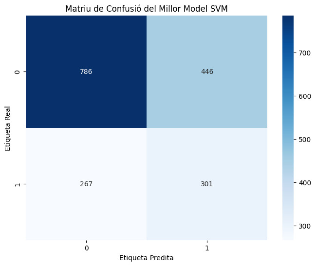
    <div class="caption">Figura 11: Matriu de confusió del model SVM</div>
  </div>
  <div class="image-column">
    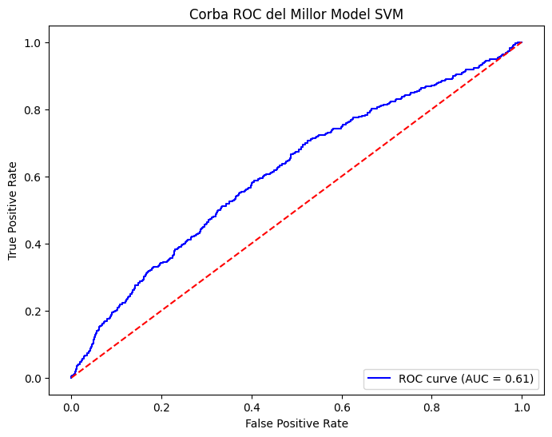
    <div class="caption">Figura 12: Corba ROC del model SVM</div>
  </div>
</div>

Per mirar si el model pateix d'algun sobreajustament, comparem l'accuracy al conjunt d'entrenament i al conjunt de prova. Trobem els valors executant la comanda `train_acc = best_svm.score(X_train_svm_final, y_train_svm)` i `test_acc = best_svm.score(X_test_svm_final, y_test_svm)`, obtenint els següents resultats que l'accuracy al train és de 0.6786 i l'accuracy al test és de 0.6039. Tenim una diferència de gairebé el 7.5% entre ambdós conjunts.

<div class="media-row" style="align-items: center; margin: 1rem 0;">
  <!-- Columna Esquerra: Text -->
  <div class="media-text" style="font-size: 8.5pt; line-height: 1.3;">
    Això indica que hi ha una diferència notable entre l'accuracy al conjunt d'entrenament i al conjunt de prova, suggerint un cert grau de sobreajustament. El model sembla adaptar-se massa bé als exemples d'entrenament, però no generalitza tan bé als nous exemples del conjunt de prova. Per mitigar aquest sobreajustament, intentem provar valors més baixos de <code>C</code> en la cerca en quadrícula, mantenint la resta de hiperparàmetres iguals. Provarem valors entre 0.01 i 0.1 perquè és el rang que la cerca en grid ha hagut de decidir. El gràfic resultant ha estat la figura 13
  </div>
  <div class="media-image" style="flex: 0 0 45%; max-width: 300px;">
    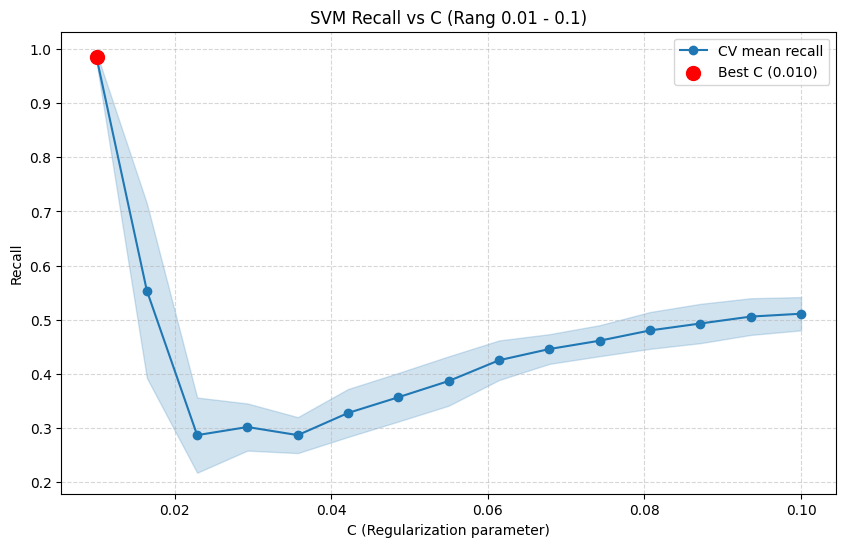
    <div class="caption">Figura 13: Gràfic d'accuracy en funció de <code>C</code></div>
  </div>
</div>

Ens retorna que el millor valor de C és ``0.036``, per tant ajustem el model final amb aquest valor i obtenim les següents mètriques:

<div class="media-row" style="align-items: center; margin: 1rem 0;">
  <!-- Columna Esquerra: Taula -->
  <div style="flex: 0 0 42%; max-width: 300px;">
    <div class="table-container" style="margin: 0; padding: 0;">
      <table style="border-collapse: collapse; width: 100%; line-height: 1.1; font-size: 6.5pt;">
        <thead>
          <tr style="background-color: #e0e0e0;">
            <th style="padding: 1px 2px; border: 1px solid #888; text-align: left;">Classe</th>
            <th style="padding: 1px 2px; border: 1px solid #888;">Prec.</th>
            <th style="padding: 1px 2px; border: 1px solid #888;">Rec.</th>
            <th style="padding: 1px 2px; border: 1px solid #888;">F1</th>
            <th style="padding: 1px 2px; border: 1px solid #888;">Supp.</th>
          </tr>
        </thead>
        <tbody>
          <tr>
            <td style="padding: 1px 2px; border: 1px solid #aaa; text-align: left;"><b><code>0</code></b></td>
            <td>0.73</td><td>0.82</td><td>0.77</td><td>1232</td>
          </tr>
          <tr style="background-color: #f5f5f5;">
            <td style="padding: 1px 2px; border: 1px solid #aaa; text-align: left;"><b><code>1</code></b></td>
            <td>0.46</td><td>0.35</td><td>0.40</td><td>568</td>
          </tr>
          <tr>
            <td style="padding: 1px 2px; border: 1px solid #aaa; text-align: left;"><b><code>accuracy</code></b></td>
            <td colspan="3" style="text-align: center;">0.67</td><td>1800</td>
          </tr>
          <tr style="background-color: #f5f5f5;">
            <td style="padding: 1px 2px; border: 1px solid #aaa; text-align: left;"><b><code>macro avg</code></b></td>
            <td>0.60</td><td>0.58</td><td>0.58</td><td>1800</td>
          </tr>
          <tr>
            <td style="padding: 1px 2px; border: 1px solid #aaa; text-align: left;"><b><code>weighted</code></b></td>
            <td>0.65</td><td>0.67</td><td>0.65</td><td>1800</td>
          </tr>
        </tbody>
      </table>
      <div class="table-caption" style="font-size: 7pt; margin-top: 2px; text-align: center;">Taula 6: Mètriques</div>
    </div>
  </div>

  <div class="media-text" style="font-size: 8.5pt; line-height: 1.3;">
    Les mètriques mostren una millora en l'accuracy global del model, que ha augmentat al 67%. La classe negativa (no TRS) manté un bon rendiment amb un F1-score del 77%, mentre que la classe positiva (TRS) mostra una lleugera millora amb un F1-score del 40%. La macro avg F1-score també ha augmentat al 58%, indicant una millor equilibració entre les classes. No obstant això, el model encara té dificultats per predir correctament la classe minoritària (TRS), com es reflecteix en el baix Recall del 35%. Això suggereix que, tot i la millora, el model encara té marge de millora en la identificació de pacients que desenvolupen TRS.
  </div>
</div>

Observem la matriu de confusió i la corba ROC actualitzades:

<div class="image-row">
  <div class="image-column">
    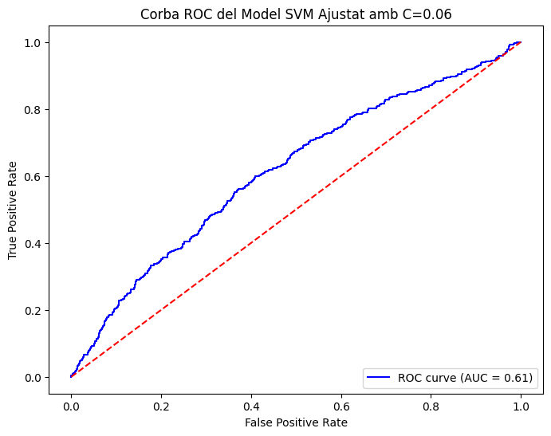
    <div class="caption">Figura 14: Corba ROC</div>
  </div>
  <div class="image-column">
    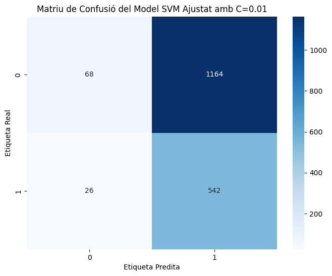
    <div class="caption">Figura 15: Matriu de confusió</div>
  </div>
</div>

Comparant el model inicial amb el nou model ajustat ``C=0.036``, s'observa una millora en la robustesa del classificador malgrat que el rendiment general segueix sent moderat. L'**AUC:** ha passat de 0.61 a **0.62**. Tot i ser un increment lleuger, indica una millor capacitat del model per separar les classes i una corba ROC més allunyada de la línia aleatòria en comparació amb el primer model.

El model ajustat també ha reduït dràsticament els errors de la classe 0 (falsos positius), passant de 446 a **227**. Això demostra que la reducció del paràmetre ``C`` ha permès crear una frontera de decisió més simple i menys propensa al soroll de les dades. Tot i així, aquesta simplificació ha penalitzat el *recall* de la classe minoritària, identificant menys casos positius (196 vs 301). És a dir, el model és ara més conservador en la predicció de la classe 1 (TRS), prioritzant la qualitat de les prediccions positives per sobre de la quantitat.

En conclusió, el model ajustat és més conservador i té un millor rendiment en la classe majoritària, aconseguint una frontera de decisió més generalitzable i menys "sobreajustada" al soroll inicial. No obstant això, encara hi ha marge de millora en la detecció de la classe minoritària, que és crucial en aquest context mèdic.

### 4.2 XGBoost

XGBoost és un model d'ensamblatge basat en arbres de decisió que utilitza l'algorisme de gradient boosting per millorar la precisió de les prediccions. Aquest model serà ajustat amb la biblioteca `xgboost`, provant diferents hiperparàmetres mitjançant una cerca en quadrícula (`GridSearchCV`).

#### 4.2.1 Preprocessament

El XGBoost és menys sensible a l'escala de les dades i als valors extrems, per la qual cosa el preprocessament serà més senzill que en el cas de l'SVM. Els passos seguits són:

1. Particionem les dades:
   Tal i com s'ha descrit a la [secció 3.6](#36-partició-del-conjunt-de-dades), dividim el conjunt de dades en un 80% per a l'entrenament i un 20% per a la prova, assegurant-nos que ambdues particions mantinguin la mateixa proporció de la variable objectiu `TRS`:

   ```python
   X_train_xgb, X_test_xgb, y_train_xgb, y_test_xgb = train_test_split(
       X, y, test_size=0.2, random_state=42, stratify=y
   )
   ```

2. Codificació de variables categòriques:
    Utilitzem l'encodificació One-Hot per a les variables categòriques, que són `Ethnicity` i `CYP2D6_metabolic_phenotype`. Això crea variables binàries per a cada categoria, permetent que el model XGBoost les utilitzi correctament.

3. Imputació de valors perduts:
   Com s'ha descrit a la [secció 3.3](#33-valors-perduts), utilitzem la imputació KNN amb k=5 per gestionar els valors perduts en les variables mèdiques. Serà necessari escalar temporalment les dades amb `StandardScaler` per a la imputació, i després desfem l'escalat amb `inverse_transform`.

#### 4.2.2 Ajustament del model

Primer de tot definim un model base d'XGBoost amb els paràmetres per defecte:

```python
xgb_base = xgb.XGBClassifier(
    objective='binary:logistic',
    random_state=42,
    n_jobs=-1,
)
```

Per tal de trobar els millors hiperparàmetres per al model XGBoost, he utilitzat una cerca en quadrícula (`GridSearchCV`) amb validació creuada de 5 plecs [[XGB25]](#bib2). Els hiperparàmetres que he considerat són:

- `n_estimators`: El nombre d'arbres a construir. He provat valors entre 50 i 300 per trobar un equilibri entre rendiment i temps de càlcul.
- `max_depth`: La profunditat màxima dels arbres. He provat valors entre 3 i 7 per controlar la complexitat del model.
- `learning_rate`: La taxa d'aprenentatge, que controla la contribució de cada arbre al model final. He provat valors baixos per evitar sobreajustaments, de 0.01 a 0.2.
- `subsample`: La fracció de mostres utilitzades per a entrenar cada arbre. He provat valors entre 0.6 i 1.0 per introduir diversitat en els arbres.
- `colsample_bytree`: La fracció de característiques utilitzades per a entrenar cada arbre. He provat valors entre 0.6 i 1.0 per introduir diversitat en les característiques.
- `scale_pos_weight`: El pes de la classe positiva per gestionar el desbalanceig de la variable objectiu. He provat diferents pesos perquè la classe minoritària tingui més influència en l'ajustament del model. Els valors provats han sigut 1, la proporció entre les classes i aquesta per 2
- `gamma`: El paràmetre de regularització que controla la complexitat dels arbres. He provat els valors de 0, 1 i 5 per veure quin s'adapta millor a les dades.

Resumit en una taula, els valors provats han sigut:

Aquí tens la taula d'hiperparàmetres per al model XGBoost, seguint exactament l'estil i l'estructura que has utilitzat anteriorment per al model SVM:

<div class="table-container">
  <table>
    <thead>
      <tr>
        <th style="text-align:left;">Hiperparàmetre</th>
        <th style="text-align:left;">Valors provats</th>
        <th style="text-align:left;">Significat</th>
      </tr>
    </thead>
    <tbody>
      <tr>
        <td style="text-align:left;"><b><code>max_depth</code></b></td>
        <td style="text-align:left;">[3,5,7]</td>
        <td style="text-align:left;">Profunditat màxima de l'arbre: controla la complexitat del model i el risc de sobreajustament.</td>
      </tr>
      <tr>
        <td style="text-align:left;"><b><code>learning_rate</code></b></td>
        <td style="text-align:left;">[0.01, 0.1, 0.2]</td>
        <td style="text-align:left;">Taxa d'aprenentatge: escala la contribució de cada nou arbre per suavitzar el procés d'optimització.</td>
      </tr>
      <tr>
        <td style="text-align:left;"><b><code>n_estimators</code></b></td>
        <td style="text-align:left;">[50,100,200,300]</td>
        <td style="text-align:left;">Nombre d'arbres: quantitat total d'iteracions de boosting a realitzar.</td
      </tr>
      <tr>
        <td style="text-align:left;"><b><code>scale_pos_weight</code></b></td>
        <td style="text-align:left;">[1, ratio, ratio*1.5, ratio*2]</td>
        <td style="text-align:left;">Control del desbalanceig: pondera la classe positiva per millorar la sensibilitat en classes minoritàries.</td>
      </tr>
      <tr>
        <td style="text-align:left;"><b><code>subsample</code></b></td>
        <td style="text-align:left;">[0.6, 0.8, 1.0]</td>
        <td style="text-align:left;">Mostreig de files: proporció de dades d'entrenament utilitzades per a cada arbre per afegir robustesa.</td>
      </tr>
      <tr>
        <td style="text-align:left;"><b><code>colsample_bytree</code></b></td>
        <td style="text-align:left;">[0.6, 0.8, 1.0]</td>
        <td style="text-align:left;">Mostreig de columnes: proporció de característiques seleccionades a l'atzar per a cada arbre.</td>
      </tr>
      <tr>
        <td style="text-align:left;"><b><code>gamma</code></b></td>
        <td style="text-align:left;">[0,1,5]</td>
        <td style="text-align:left;">Regularització conservadora: pèrdua mínima requerida per realitzar una partició addicional en un node.</td>
      </tr>
      <tr>
        <td style="text-align:left;"><b><code>eval_metric</code></b></td>
        <td style="text-align:left;">['logloss', 'auc']</td>
        <td style="text-align:left;">Mètrica d'avaluació: criteri utilitzat per monitorar el rendiment durant la validació.</td>
      </tr>
    </tbody>
  </table>
  <div class="table-caption"> Taula 7: Espai de cerca d'hiperparàmetres per al model XGBoost.</div>
</div>

El resultat de la cerca ens proporciona els millors hiperparàmetres per al model XGBoost:

```bash
 {'colsample_bytree': 1.0, 'eval_metric': 'logloss', 'gamma': 5, 'learning_rate': 0.01, 'max_depth': 7, 'n_estimators': 300, 'scale_pos_weight': np.float64(2.171806167400881), 'subsample': 0.6}
```

Aquest model utilitza una profunditat màxima de 7 per als arbres, amb una taxa d'aprenentatge baixa de 0.01 per evitar sobreajustaments. El nombre d'arbres és de 300, i s'utilitza un mostreig de files del 60% i un mostreig de columnes del 100% per introduir diversitat en els arbres. El paràmetre `scale_pos_weight` s'ha ajustat a la proporció entre les classes, sense multiplicar, per donar més pes a la classe minoritària. Finalment, el paràmetre `gamma` s'ha establert en 5 per aplicar una regularització més forta i evitar particions innecessàries en els arbres.
Aquest model, de base, em fa sospitar que hi ha molt de sobreajustament, ja que té molts arbres i una profunditat alta, però la taxa d'aprenentatge baixa podria ajudar a mitigar-ho, per tant caldrà analitzar-ho més endavant.

Observem les mètriques d'avaluació del model XGBoost ajustat al conjunt de prova:

<div class="media-row" style="align-items: center; margin: 1rem 0;">
  <div style="flex: 0 0 40%; max-width: 320px;">
    <div class="table-container" style="margin: 0; padding: 0;">
      <table style="border-collapse: collapse; width: 100%; line-height: 1; font-size: 6.5pt;">
        <thead>
          <tr style="background-color: #e0e0e0;">
            <th style="padding: 2px 3px; border: 1px solid #888; text-align: left; min-width: 50px;">Classe</th>
            <th style="padding: 2px 3px; border: 1px solid #888;">Prec.</th>
            <th style="padding: 2px 3px; border: 1px solid #888;">Rec.</th>
            <th style="padding: 2px 3px; border: 1px solid #888;">F1</th>
            <th style="padding: 2px 3px; border: 1px solid #888;">Supp.</th>
          </tr>
        </thead>
        <tbody>
          <tr>
            <td style="padding: 2px 3px; border: 1px solid #aaa; text-align: left;"><b><code>0</code></b></td>
            <td style="padding: 2px 3px; border: 1px solid #aaa;">0.74</td>
            <td style="padding: 2px 3px; border: 1px solid #aaa;">0.63</td>
            <td style="padding: 2px 3px; border: 1px solid #aaa;">0.68</td>
            <td style="padding: 2px 3px; border: 1px solid #aaa;">1232</td>
          </tr>
          <tr style="background-color: #f5f5f5;">
            <td style="padding: 2px 3px; border: 1px solid #aaa; text-align: left;"><b><code>1</code></b></td>
            <td style="padding: 2px 3px; border: 1px solid #aaa;">0.40</td>
            <td style="padding: 2px 3px; border: 1px solid #aaa;">0.52</td>
            <td style="padding: 2px 3px; border: 1px solid #aaa;">0.45</td>
            <td style="padding: 2px 3px; border: 1px solid #aaa;">568</td>
          </tr>
          <tr>
            <td style="padding: 2px 3px; border: 1px solid #aaa; text-align: left;"><b><code>accuracy</code></b></td>
            <td colspan="3" style="padding: 2px 3px; border: 1px solid #aaa; text-align: center;">0.60</td>
            <td style="padding: 2px 3px; border: 1px solid #aaa;">1800</td>
          </tr>
          <tr style="background-color: #f5f5f5;">
            <td style="padding: 2px 3px; border: 1px solid #aaa; text-align: left;"><b><code>macro</code></b></td>
            <td>0.57</td><td>0.58</td><td>0.57</td><td>1800</td>
          </tr>
          <tr>
            <td style="padding: 2px 3px; border: 1px solid #aaa; text-align: left;"><b><code>weighted</code></b></td>
            <td>0.63</td><td>0.60</td><td>0.61</td><td>1800</td>
          </tr>
        </tbody>
      </table>
      <div class="table-caption"; margin-top: 2px; text-align: center;">Taula 5: Resultats del model</div>
    </div>
  </div>

  <div class="media-text" style="font-size: 8.5pt; line-height: 1.3;">
    <p style="margin: 0 0 0.5rem 0;">Podem veure que el model XGBoost té un rendiment similar al model SVM, amb una <b>accuracy</b> del 60%, és a dir, el 60% de les prediccions són correctes. Veiem que assigna correctament el 63% de la classe 0 (no TRS) i el 52% de la classe 1 (TRS).</p>
    <p style="margin: 0;">També veiem que de les que assigna a la classe 1, només el 40% són correctes. Això indica que el model té dificultats per identificar correctament els pacients amb TRS, ja que hi ha molts falsos positius. Pel que fa a les que assigna a la classe 0, el 74% són correctes, però hi ha un 37% de falsos negatius, és a dir, pacients amb TRS que són classificats com a no TRS. Més enllà, l'<b>F1-score ponderat</b> és del 61%, indicant un rendiment moderat en general.</p>
  </div>
</div>

Comprovem la matriu de confusió i la corba ROC:

<div class="image-row">
  <div class="image-column">
    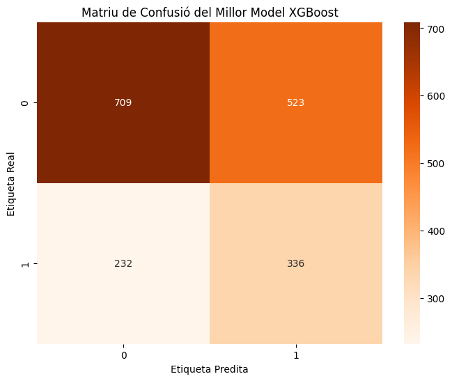
    <div class="caption">Figura 16: Matriu de confusió del model XGBoost</div>
  </div>
  <div class="image-column">
    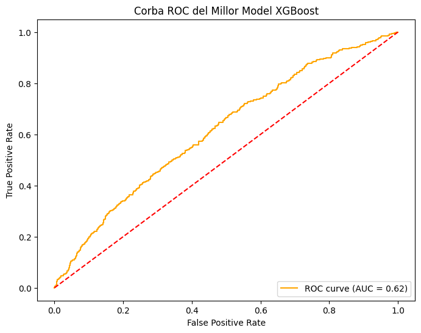
    <div class="caption">Figura 17: Corba ROC del model XGBoost</div>
  </div>
</div>

Veiem que els resultats són molt similars als del model SVM, amb una AUC de 0.62, indicant una capacitat moderada per separar les classes. La matriu de confusió mostra que hi ha un nombre significatiu de falsos positius i falsos negatius, suggerint que el model té dificultats per identificar correctament els pacients amb TRS. Aquest comportament és similar al del model SVM, indicant que ambdós models tenen limitacions en la seva capacitat per predir aquesta condició mèdica específica. Comprovem també si hi ha sobreajustament comparant l'accuracy al conjunt d'entrenament i al conjunt de prova. Obtenim que el train té un accuracy de 0.8149 i el test de 0.5972, per tant hi ha una diferència molt gran entre ambdós conjunts, indicant un sobreajustament molt elevat. Per tant, caldrà ajustar els hiperparàmetres per tal de reduir aquest sobreajustament. Visualitzem també les corbes d'aprenentatge per veure com evoluciona l'error en funció del nombre d'arbres, ens pot donar un indicador de si cal augmentar o reduir el nombre d'arbres i quants:

<div class="image-row">
  <div class="image-column">
    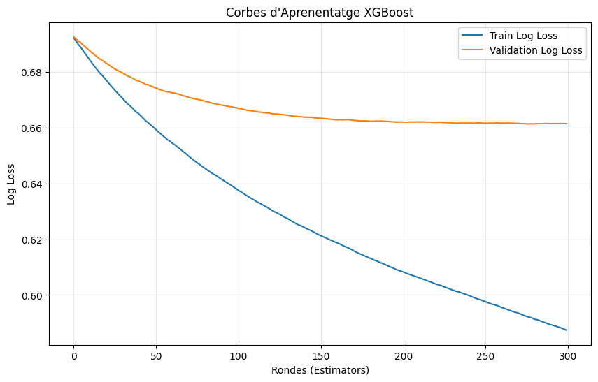
    <div class="caption">Figura 18: Corbes d'aprenentatge del model XGBoost</div>
  </div>
</div>

Veiem que a partir de la ronda 100, l'error de validació comença a creixer, indicant que el model comença a sobreajustar-se. Per tant, podem reduir el nombre d'arbres a 100 per tal de reduir el sobreajustament. Mirem de refinar ara la profunditat màxima dels arbres, provant valors de l'1 al 10, per veure quin és el millor valor per tal de reduir el sobreajustament. Mantenim la resta d'hiperparàmetres de moment. El gràfic resultant és la figura 19

<div class="media-row">
  <div class="media-image">
    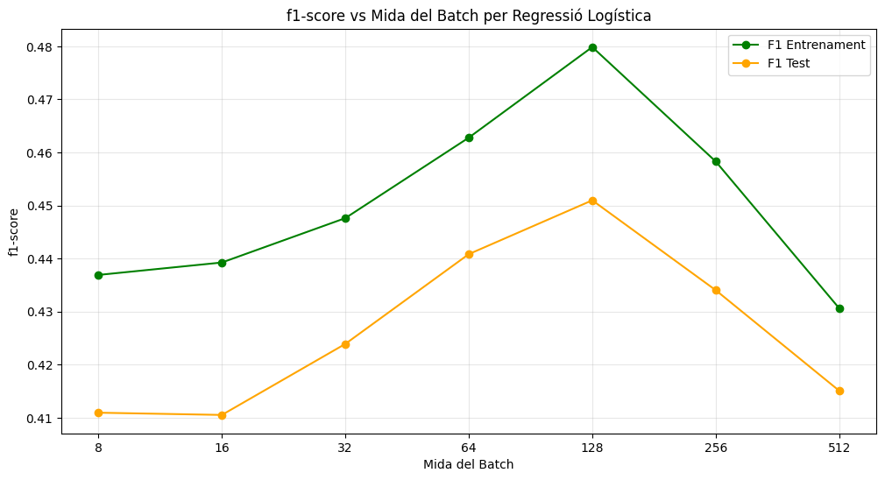
    <div class="caption">Figura 19: Gràfic de profunditat màxima vs accuracy</div>
  </div>

  <div class="media-text">
    <p>
      Veiem que l'<b>accuracy</b> augmenta a mida que la profunditat augmenta; per tant, no sembla que reduir la profunditat ajudi a reduir el sobreajustament. Tot i així, per simplicitat, establim la profunditat a <b>7</b>, que és un valor intermedi.
    </p>
  </div>
</div>

Provem doncs a mirar de reduir el valor gamma, ja que aquest paràmetre controla la complexitat dels arbres i podria ajudar a reduir el sobreajustament. Provem diferents valors del 0 al 10, per veure si això ajuda a reduir el sobreajustament:

<div class="media-row">
  <div class="media-image">
    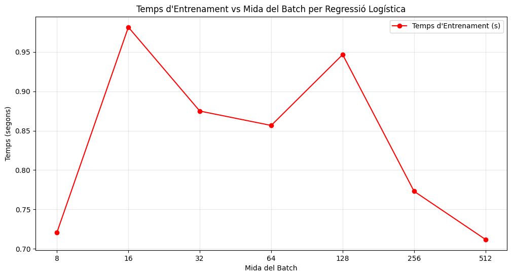
    <div class="caption">Figura 20: Gràfic de gamma vs accuracy</div>
  </div>

  <div class="media-text">
    <p>
      Veiem ara que l'<b>accuracy</b> disminueix a mida que <code>gamma</code> augmenta; per tant, sembla que reduir el valor de <code>gamma</code> era el culpable del sobreajustament. Establim doncs <code>gamma</code> a <b>0</b>.
    </p>
  </div>
</div>

Ens queda un model final amb els següents hiperparàmetres ajustats:

```bash
{'colsample_bytree': 1.0, 'eval_metric': 'logloss', 'gamma': 0, 'learning_rate': 0.01, 'max_depth': 7, 'n_estimators': 100, 'scale_pos_weight': np.float64(2.171806167400881), 'subsample': 0.8}
```

També augmentem el `subsample` a 0.8 per tal de reduir el sobreajustament, ja que amb un valor més alt, cada arbre veu més dades i per tant és menys propens a sobreajustar-se.

### 4.3 Regressió logística personalitzada

#### 4.3.1 Preprocessament

#### 4.3.2 Ajustament del model

#### 4.3.3 Resultat final

## 5. Model final

## 6. Model Card

## 7. Conclusions

## 8. Referències

<a name="bib1"></a> [SKL25]: Scikit-learn developers. (n.d.). SVC — scikit-learn 1.7.2 documentation. Recuperat el 21 de desembre de 2025, de [https://scikit-learn.org/stable/modules/generated/sklearn.svm.SVC.html](https://scikit-learn.org/stable/modules/generated/sklearn.svm.SVC.html)

<a name="bib2"></a> [XGB25]: XGBoost developers. (s.f.). XGBoost Parameters. Recuperat el 21 de desembre de 2025, de [https://xgboost.readthedocs.io/en/stable/parameter.html](https://xgboost.readthedocs.io/en/stable/parameter.html)
